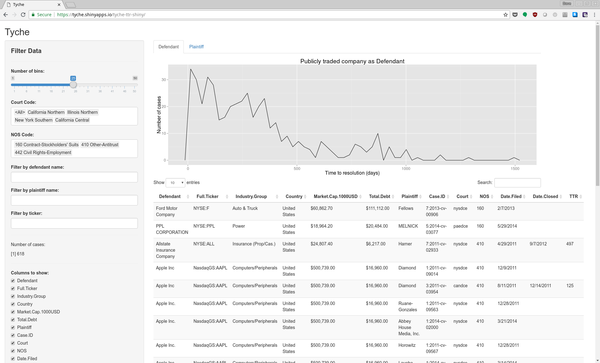
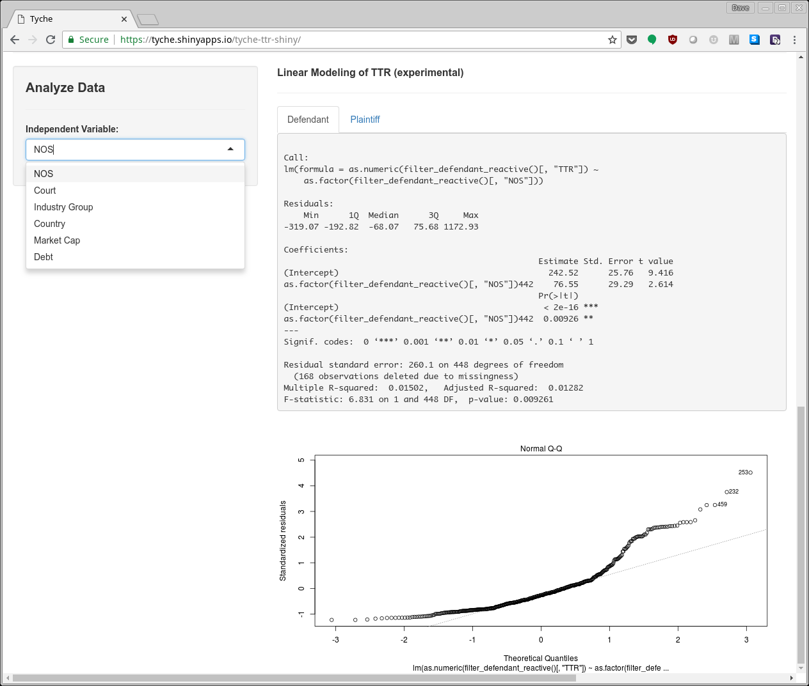

 
<b>Tools for extracting data from PACER summaries and graphically building linear models of time-to-resolution</b> 

## Collecting Data

[PACER](https://www.pacer.gov/) (Public Access to Court Electronic Records) is an electronic public access service that allows users to obtain case and docket information online from federal appellate, district, and bankruptcy courts, and the PACER Case Locator.

PACER is a paid service, and collecting summary information is far less expensive than gathering full case documents. Command line tools (wget, curl, etc.) can be used to harvest html search results from PACER with minimal fees incurred, then these html pages are fed into this utility to extract summary information for each docket: 

- Case ID
- Plaintiff name
- Defendant
- Court
- NOS (Nature of Suit) Code
- Date Filed
- Date Closed

## Linear Models

Once the CSV is populated from the summary data, we augment the summary data public data including:

 - Stock ticker
 - Industry Group
 - Country
 - Market Cap
 - Debt

We can then plug the augmented data into an interactive web dashboard built on [R](https://www.r-project.org/) and [Shiny](https://shiny.rstudio.com/). This dashboard allows for data filtering, exploration, linear model development, and model evaluation. 

This dashboard is currently hosted at: https://tycherisk.co/ttr-demo

### Dashboard Screenshots

#### Data Exploration Dashboard

#### Linear Model Dashboard

